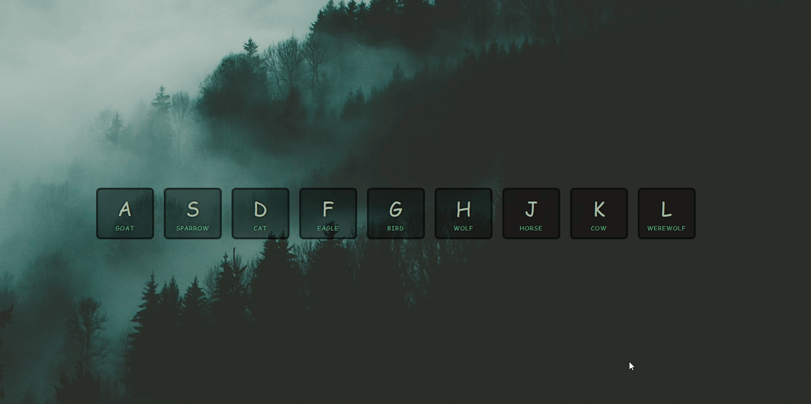

# Drum Kit



I create  a **dynamic drum kit** that's both fun and interactive.
Each key corresponds to a unique **animal sound** and triggers a cool **animation**.
Let me walk you through how I **accomplished** this and what i **add/fix** from the original solution

## Table of Contents

- [Drum Kit](#drum-kit)
  - [Table of Contents](#table-of-contents)
  - [Features](#features)
  - [How I Made It Happen](#how-i-made-it-happen)
  - [What I Added or Fixed Compared to the Original Solution](#what-i-added-or-fixed-compared-to-the-original-solution)
  - [What I Learned](#what-i-learned)

## Features

- When I **click** a key or **press** the corresponding key on my keyboard, a lively sound is played, creating a truly immersive experience.
- The **animation** I added gives the whole interface a playful vibe, making it more engaging and visually appealing.
- I made sure the animation disappears seamlessly after the transition ends, keeping the user interface clean and smooth.

## How I Made It Happen

1. I started by selecting all the `.key` elements

   ```javascript
   const keys = document.querySelectorAll(".key");
   ```

2. The `keyClicked` function became the driving force behind the magic, when i click/press a key on keyboard or mouse the `keyClicked()` function is called

  ```javascript
  function keyClicked() {
    // Get the value of the 'data-key' attribute from the clicked element
    const keyCode = this.dataset.key;

    // Find the corresponding audio element with the same data-key attribute
    const audio = document.querySelector(`audio[data-key="${keyCode}"]`);
    if (audio) {
      // Reset the audio playback to the beginning
      audio.currentTime = 0;

      // Play the audio
      audio.play();

      // Add the "playing" class to the clicked element
      this.classList.add("playing");

      // Listen for the 'transitionend' event on the clicked element only 'once'
      // This event is triggered when the CSS transition is completed
      this.addEventListener("transitionend", () => {
          // Remove the "playing" class from the element
          this.classList.remove("playing");
          },
          // executed only once
          { once: true }
        );
    }
  }
  ```

- `if (audio) { ... }`: This condition checks if an `audio` element is associated with the clicked key. If an `audio` element exists, it means there is a corresponding sound to play.

- `audio.currentTime = 0;`: This line sets the `currentTime` property of the `audio` element to 0. This ensures that the sound starts playing from the beginning, even if it's already playing or has finished playing.

- `audio.play();`: This line plays the audio associated with the clicked key, creating the sound effect.

- `this.classList.add("playing");`: Here, the "playing" class is added to the clicked element (`this`). This class triggers the animation, making the element visually stand out.

- `this.addEventListener("transitionend", () => { ... }, { once: true });`: This line adds an event listener to the clicked element to listen for the `transitionend` event. The `transitionend` event is fired when a CSS transition is completed. The event listener's function removes the "playing" class from the element, thus ending the animation.

  - `{ once: true }`: This option ensures that the event listener is executed only once, preventing it from being triggered multiple times if the transitionend event fires again.

3. For an added touch of excitement, I included a `keydown` event listener on the `window` to simulate keyboard interactions:

   ```javascript
   window.addEventListener("keydown", (e) => {
    // Find the corresponding key element based on the key code
     const key = document.querySelector(`div[data-key="${e.keyCode}"]`);

    // Check if a corresponding key element was found
    if (key) {
    // Simulate a click event on the key element
    key.click();
    }
   });
   ```

4. To ensure a consistent and delightful experience, I added a `click` event listener to each `.key` element:

   ```javascript
   keys.forEach((key) => key.addEventListener("click", keyClicked));
   ```

## What I Added or Fixed Compared to the Original Solution

1. My own style and audio
2. Another useful technique is to ensure that an **event** triggers only once by utilizing the `{ once: true }` option, This can be particularly advantageous for achieving **smooth** **animations**, By implementing this, even if the user **types** **rapidly**, the event will be triggered only once. This not only enhances **performance** but also guarantees a **seamless** **animation** **experience**.
3. Fix styling problem with `user-select: none;`
     the problem is when user click on window area an courser appear by keys and the text is selectable on keys and the span ,
     to fix this i add : `user-select: none;` to the `.keys` classe :

```css
 .keys {
  /*prevent from selecting or or highlighting the text
    within that element using mouse or keyboard input.*/
  user-select: none;
  ...
}
```

## What I Learned

Throughout this exercise, I got hands-on experience with:

- Using the `data-key` attribute to pass data to **JavaScript** using the `dataset` object.
- Manipulating the `audio` object, including the `play()` method and `currentTime` property.
- Responding to the `keydown` event to create an immersive interaction.
- Simulating a `click` event on a key element using `key.click()`.
- Utilizing the `transitionend` event for smooth **animations**.
- Ensuring an event triggers only **once** with the `{ once: true }` option.
