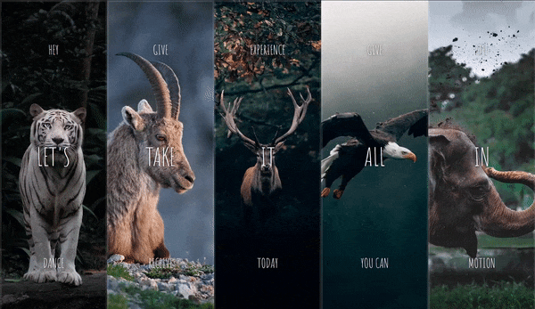
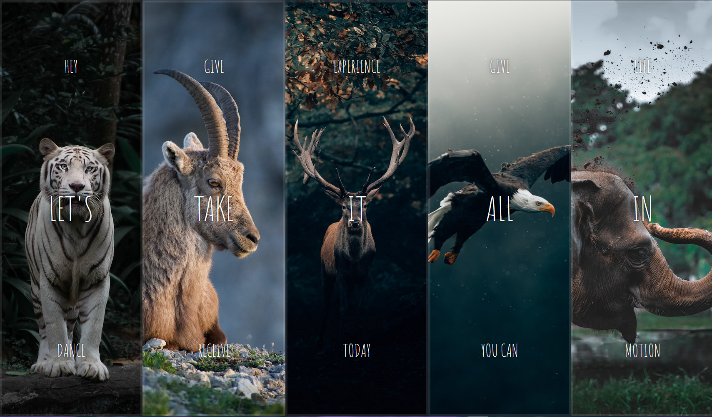

# Flex Panel Gallery

<video src="assets/images/showcase.mp4" controls title="Title"></video>

<!--  -->




In this exercise, I created an interactive **flex panel gallery** that allows users to click on individual panels to reveal additional content.
The clicked panel expands both in size and reveals hidden text, providing an engaging and dynamic user experience.

Let's delve into the code and understand how I **achieved** this and what i **add/fix** from the original solution.

## Table of Contents

- [Flex Panel Gallery](#flex-panel-gallery)
  - [Table of Contents](#table-of-contents)
  - [How I Made It Happen](#how-i-made-it-happen)

## How I Made It Happen

```js
// Select all panel elements from the HTML
const images = document.querySelectorAll(".panel");

// Function to handle image click event
function handleImageClick() {
 // Toggle the "active" class on the clicked panel
 this.classList.toggle("active");
}

// Add a click event listener to each panel element
images.forEach((img) => img.addEventListener("click", handleImageClick));
```
