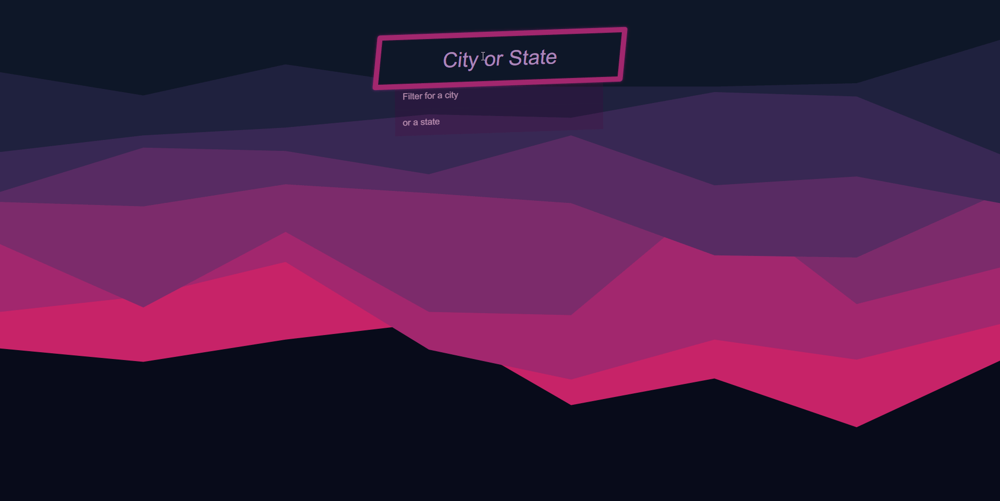

# Type Ahead



In this exercise, I implemented a **Type Ahead** feature that offers instant search suggestions as users type into a search input field.

The suggestions are drawn from a dataset of cities and states, creating a dynamic and user-friendly search experience.

Let's delve into the code and understand how I **achieved** this and what i **add/fix** from the original solution.

## Table of Contents

- [Type Ahead](#type-ahead)
  - [Table of Contents](#table-of-contents)
  - [Features](#features)
  - [How I Made It Happen](#how-i-made-it-happen)
    - [1. Fetching Data](#1-fetching-data)
    - [2. Copying Fetched Data to a Global Variable](#2-copying-fetched-data-to-a-global-variable)
    - [3. Filtering Cities](#3-filtering-cities)
    - [4. Number Formatting](#4-number-formatting)
    - [5. Displaying Matched Cities](#5-displaying-matched-cities)
    - [6. Debounce Function](#6-debounce-function)
    - [7. Input Event Handling](#7-input-event-handling)
    - [8. Initialization](#8-initialization)
  - [What I Added or Fixed Compared to the Original Solution](#what-i-added-or-fixed-compared-to-the-original-solution)
  - [The challenges I faced](#the-challenges-i-faced)
  - [Introduction](#introduction)
    - [Resolving the Error](#resolving-the-error)
    - [Better solutions](#better-solutions)
  - [What I Learned](#what-i-learned)

## Features

1. **Instant Search Suggestions**: As users type in the search input, the project instantly provides matching suggestions from the city and state dataset.

2. **Fallback Handling**: If no matches are found, a default message is displayed to guide users.

3. **Optimized Input Handling**: To improve performance, the debounce function ensures the input event handling is optimized and prevents excessive function calls.

4. **Regular Updates**: The project updates the suggestions list with matching cities as the user types, providing a smooth and engaging search experience.

5. **Highlight Matched Words**: Matched search terms are dynamically highlighted within the displayed suggestions, aiding users in quickly identifying relevant information.

6.**Handling Fetch Errors** : Checks the response status , catch errors ...

## How I Made It Happen

### 1. Fetching Data

- The project starts by utilizing the `fetchData` async function to fetch city data from a provided URL. The fetched data is then logged, and error handling is implemented to address any response issues.
- Upon initiating a fetch request, the code checks the **response** **status** using `response.ok` , If the **response** **status** is not within the range of **successful** **status** **codes**, an `Error` object is thrown, containing a descriptive **error** **message**.
- If the fetch operation encounters an error, the `catch` block is triggered, and the specific error message is displayed using `console.error()`.
- The function returns a `null` value, which can be utilized as a **fallback** mechanism or to indicate the **absence** **of** **data**.

```js
    // fetch data from a URL
    async function fetchData(url) {
     try {
      const response = await fetch(url);

      if (!response.ok) {
       throw new Error(`HTTP error! Status: ${response.status}`);
      }

      const data = await response.json();
      console.log(data);

      return data;
     } catch (error) {
      console.error("Error:", error.message);
      // Handle the error or provide fallback data
      return null;
     }
    }

    // An array to store cities data and URL to fetch data from
   const citiesData = [];
   const url = "...";
```

### 2. Copying Fetched Data to a Global Variable

- `getData()` : This function is responsible for retrieving data from the server and copying it into the global variable citiesData.
- Upon successfully **fetching** the data, the `getData()`function uses the `await` keyword to pause execution until the data is available. The fetched data, represented as an array of city objects, is assigned to the data variable.

```js
    // copy fetched data into the global var citiesData
    async function getData() {
     try {
      const data = await fetchData(url);
      citiesData.push(...data);
     } catch (error) {
      console.error("Error fetching data:", error.message);
      // Handle the error or provide fallback data
     }
    }

   getData();
```

### 3. Filtering Cities

- The `filterCities` function accepts a search term and filters the `citiesData` array based on matching city names or state names using regular expressions. In cases where no matches are found, a default message is provided.

- **Regular Expression Search**: The core of the filtering process revolves around utilizing a regular expression (**regex**) to match the search term against both **city** and **state** names.
  - The `gi` flags ensure a global and case-insensitive search.

- **Array Filtering**: The `filter()` method is then applied to the **cities** array, allowing for a streamlined extraction of city objects that match the provided search term.

- **Fallback Message**: In situations where no matches are found, it's important to communicate this to the user , To achieve this, a **default** **message** is crafted as a fallback. This message is encapsulated within an object with properties **city**, **state**, and **population**, which represent placeholder values for a `"no match"` scenario.

```js
    // Function to filter cities based on search term
    function filterCities(cities, searchItem) {
     const regex = new RegExp(searchItem, "gi");
     const filteredCities = cities.filter((object) => object.state.match(regex) || object.city.match(regex));
     const defaultMessage = [{ city: "no match city", state: "no match state", population: "/" }];
     return filteredCities.length === 0 ? defaultMessage : filteredCities;
    }
```

### 4. Number Formatting

- The `numberWithCommas` function is used to format **population** numbers with commas, enhancing readability.

```js
    // Function to format (population) numbers  with commas
    function numberWithCommas(x) {
     return x.toString().replaceAll(/\B(?=(\d{3})+(?!\d))/g, ",");
    }
```

### 5. Displaying Matched Cities

- The `displayCities` function takes matched **city** **data** and the **search** **term** as parameters.
- It generates HTML code to display the matched **cities** **names** and their **populations**.
- The search term is highlighted within the city and state names using the `<span>` element.

- The `numberWithCommas()` function is employed to **format** the **population** **number** with **commas** for improved readability.

```js
    function displayCities(matchedCitiesArray, searchTerm) {
      const html = matchedCitiesArray
      .map((object) => {
        const regex = new RegExp(searchTerm, "gi");
        const cityName = object.city.replace(regex, `<span class="hl">${searchTerm}</span>`);
        const stateName = object.state.replace(regex, `<span class="hl">${searchTerm}</span>`);
        return `
         <li>
             <span class="name">${cityName}, ${stateName}</span>
             <span class="population">${numberWithCommas(object.population)}</span>
         </li>
        `;
      })
      .join("");
     suggestionsList.innerHTML = html;
    }
```

### 6. Debounce Function

- The `debounce()` function ensures optimal handling of input events like where user interactions can trigger frequent function calls (typing fast in the input field )
- By using a timer, it **delays** the execution of the `handleInput` function to prevent excessive function calls while users are typing.
- This mitigates the **performance** impact of rapid user input changes, prevents excessive function calls, and provides a **smoother** and more efficient search experience.

```js
    function debounce(function_, delay) {
     let timer;
     return function (...arguments_) {
      clearTimeout(timer);
      timer = setTimeout(() => function_.apply(this, arguments_), delay);
     };
    }
```

### 7. Input Event Handling

- The `handleInput` function is called whenever the user types into the search input field.
- It **filters** **cities** based on the **search** **term** and dynamically displays the matching suggestions using the `displayCities` function.

```js
  // Handler for input changes
     function handleInput(event) {
      const searchTerm = event.target.value;

      const matchedCitiesArray = filterCities(citiesData, searchTerm);
      displayCities(matchedCitiesArray, searchTerm);
     }

```

### 8. Initialization

- DOM elements such as the suggestions list and search input are selected using `querySelector`.
- The input event listener on the search input is wrapped with the `debounce` function to optimize input event handling  and prevent excessive function calls during rapid typing, it's introduces a **300ms** delay between consecutive invocations..

```js
    const suggestionsList = document.querySelector(".suggestions");
    const searchInput = document.querySelector(".search");

     // Add the input event listener with debounce (300ms delay)
     searchInput.addEventListener("input", debounce(handleInput, 300));
```

## What I Added or Fixed Compared to the Original Solution

1. **My Own style**
2. **Enhanced Data Fetching and Error Handling** : I extended the data **fetching** functionality by implementing a robust **error-handling** mechanism using the `fetchData()` function.
This function uses the `async/await` pattern to **fetch** data from a specified URL.
In case of a network **error** or **non-OK** status response, I throw an **error** and handle it gracefully by logging an **error** **message** and providing fallback data
3. **Fallback Handling**: If no matches are found, a **default** **mes  sage** is displayed to guide users.
4. **Optimized Input Handling**: To improve **performance**, the `debounce` function ensures the input event handling is **optimized** and prevents excessive function calls.

## The challenges I faced

## Introduction

- I starte to integrate `async`/`await` instead of old `then()` into my project, I encountered a perplexing error:

```javascript

    async function fetchData(url) {
         const response = await fetch(url);
         const data = await response.json();
         return data;
       }
    let data = await fetchData();
  // SyntaxError: await is only valid in async functions and the top level bodies of modules
```

### Resolving the Error

- The error message, `await is only valid in async functions and the top level bodies of modules` simply means that the `await` keyword can only be used inside an `async` function or at the top level of a module.
- In my case, the error was caused by trying to use `await` in a context where the containing function was not declared as `async`.

- I have intentionally removed the `try/catch` block from the example for the sake of simplicity.

```javascript
  // ❌ Error: await used outside async function
  let data = await fetchData();

  // ✔️ Correct: await used inside async function
   async function getData() {
     const data = await fetchData(url);
     citiesData.push(...data);
   }

   getData() ;
```

### Better solutions

- In the preview example, I resolved the issue by wrapping the `fetchData` function within an `async` function. However, it's worth noting that in recent years, the use of `await` is permitted at the **top level of a module**

1. **Convert to a Module:** By converting the script type to a module.

   ```html
   <script type="module" src="script.js"></script>
   ```

2. **Update Package.json for ES Modules:**  update the `package.json` file to indicate that the code uses **ES6 module syntax**. this will change the `"type"` property to `"module"` and you must replace **CommonJS** syntax (`require`) with ES6 module syntax (`import`) in all js files.

> You can modify the file extension, for example, from main.js to main.mjs, to indicate that the file is using ES6 module syntax.

   ```json
   {
       "name": "my-project",
       "type": "module",
       "dependencies": {
           "my-dependency": "^1.0.0"
       }
   }
   ```


## What I Learned

- **Asynchronous Programming with Async/Await** : This project allowed me to gain hands-on experience with asynchronous operations and data manipulation using the fetch API.
- I deepened my understanding of regular expressions and their usage for dynamic data filtering.
- **Optimization for Performance**: Through the use of debounce functions and optimized event handling, I learned how to design code to prioritize performance and minimize unnecessary function calls.
- **Dynamic HTML generation and manipulation** were key aspects of this project.
