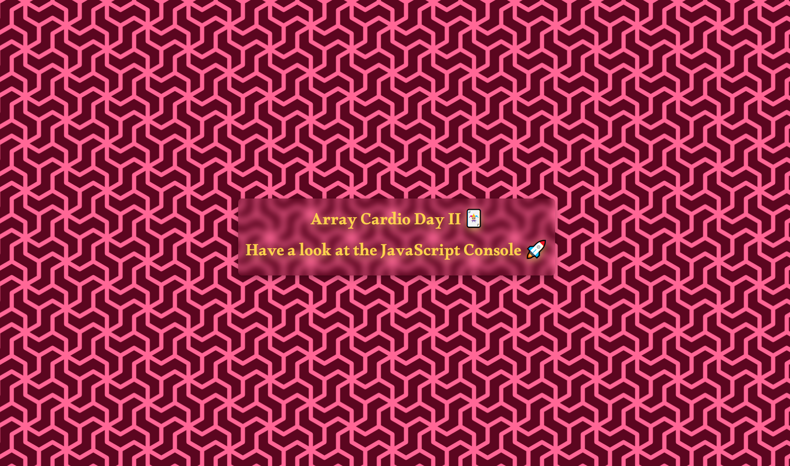

# Exploring Array Methods - Array Cardio Day 2



In this coding exercise, I explored various **array methods** to manipulate and analyze arrays of data.
I worked with arrays of people's information and comments, performing operations such as **filtering**, **checking**, **finding**, and **deleting**.

## Table of Contents

- [Exploring Array Methods - Array Cardio Day 2](#exploring-array-methods---array-cardio-day-2)
  - [Table of Contents](#table-of-contents)
  - [Some and Every Checks](#some-and-every-checks)
    - [1. Checking if at Least One Person is 19 or Older](#1-checking-if-at-least-one-person-is-19-or-older)
    - [2. Checking if Everyone is 19 or Older](#2-checking-if-everyone-is-19-or-older)
  - [Array.prototype.find()](#arrayprototypefind)
    - [Find Comment with a Specific ID](#find-comment-with-a-specific-id)
  - [Array.prototype.findIndex()](#arrayprototypefindindex)
    - [Find Index of Comment with a Specific ID](#find-index-of-comment-with-a-specific-id)
    - [Delete Comment with a Specific ID](#delete-comment-with-a-specific-id)

## Some and Every Checks

### 1. Checking if at Least One Person is 19 or Older

```js
let display = people.some((person) => new Date().getFullYear() - person.year >= 19);
console.log(display);
```

### 2. Checking if Everyone is 19 or Older

```js
display = people.every((person) => new Date().getFullYear() - person.year >= 19);
console.log(display);
```

## Array.prototype.find()

### Find Comment with a Specific ID

```js
display = comments.find((comment) => comment.id === 823423);
console.log(display);
```

## Array.prototype.findIndex()

### Find Index of Comment with a Specific ID

```js
const index = comments.findIndex((comment) => comment.id === 823423);
console.log(index);
```

### Delete Comment with a Specific ID

```js
const newComments = [...comments.slice(0, index), ...comments.slice(index + 1)];
console.log(newComments);
```
