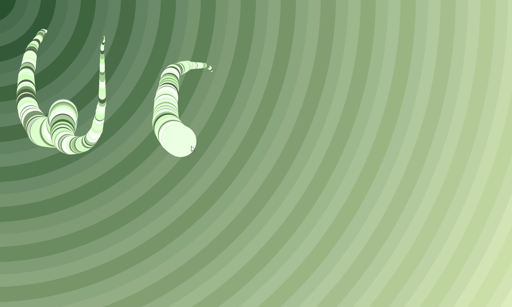

# Canvas Drawing with Green Palette



In this exercise, I created an interactive canvas drawing experience where users can freely draw lines on a canvas with a dynamic and randomized **green** **color** **palette**.

The line width also animates, creating an engaging visual effect.

Let's delve into the code and understand how I **achieved** this and what i **add/fix** from the original solution.

## Table of Contents

- [Canvas Drawing with Green Palette](#canvas-drawing-with-green-palette)
  - [Table of Contents](#table-of-contents)
  - [Features](#features)
  - [How I Made This Happen](#how-i-made-this-happen)
    - [1. Canvas and Context Setup](#1-canvas-and-context-setup)
    - [2. Drawing Function](#2-drawing-function)
    - [3. Pointer Events](#3-pointer-events)
  - [What I Added/Fixed](#what-i-addedfixed)
  - [What I Learned](#what-i-learned)

## Features

1. **Interactive Drawing**: The canvas allows users to draw lines using their **mouse**/**touche**/**pen** using `pointure` event.

2. **Colorful Animation**: Each drawn line is automatically colored using a random **green** **shade** from the palette, providing a visually pleasing and creative experience.

## How I Made This Happen

### 1. Canvas and Context Setup

- I selected the canvas element using `document.querySelector('#draw')` and obtained its 2D context. The canvas dimensions were set to match the window size using `canvas.width = window.innerWidth` and `canvas.height = window.innerHeight`.

```js
   const canvas = document.querySelector("#draw");
   const context = canvas.getContext("2d");
   canvas.width = window.innerWidth;
   canvas.height = window.innerHeight;
   context.lineJoin = "round";
   context.lineCap = "round";
   context.lineWidth = 10;
```

### 2. Drawing Function

- The `draw` function is the core of the drawing mechanism. It's triggered when the mouse moves over the canvas. If `isDrawing` is `true`, the function starts drawing lines.

- I created a `greenPalette` array with different shades of green. Each time the `draw` function is called, a random green color is selected from the palette using `Math.floor(Math.random() * greenPalette.length)`.

- An animation effect is achieved by changing the line width over time. The `direction` variable controls whether the line width is increasing or decreasing. The line width changes direction when it reaches certain bounds.

```js
  // Initialize variables
  let isDrawing = false; // Flag to track if the mouse button is pressed
  let lastX = 0; // X coordinate of the last position of the mouse
  let lastY = 0; // Y coordinate of the last position of the mouse
  let direction = true; // Flag to track the direction of line width changes

  // Define a palette of green colors
  const greenPalette = ["#fafff8", "#f5fff0", "#ebffe1", "#e0ffd2", "#d6ffc3", "#ccffb4", "#a3cc90", "#7a996c", "#526648"];

  // Function to draw lines on the canvas
  function draw(e) {
    if (!isDrawing) return; // If mouse button is not pressed, exit the function

    // Select a random green color from the palette
    const randomGreen = greenPalette[Math.floor(Math.random() * greenPalette.length)];

    context.strokeStyle = randomGreen; // Set the stroke color to the random green
    context.beginPath(); // Start a new path
    context.moveTo(lastX, lastY); // Move to the last mouse position
    context.lineTo(e.clientX, e.clientY); // Draw a line to the current mouse position
    context.stroke(); // Apply the stroke to render the line

    // Update last mouse position
    [lastX, lastY] = [e.clientX, e.clientY];

    // Check if the line width is within certain bounds
    if (context.lineWidth >= 100 || context.lineWidth <= 1) {
      direction = !direction; // Change the direction if the bounds are reached
    }

    // Increase or decrease the line width based on the direction
    if (direction) {
      context.lineWidth++;
    } else {
      context.lineWidth--;
    }
  }


```

### 3. Pointer Events

- I opted for utilizing the more versatile **pointer events** in place of traditional **mouse events**.
- **Pointer events** offer a unified approach to handling various input methods, including **mouse**, **touch**, **pen**, and more.
  Here's how the pointer events are leveraged to enhance the drawing interaction:

1. The drawing action is initiated by pressing down on the input surface (e.g., mouse button, touch screen) through the `pointerdown` event. This event captures the initial interaction point.

```js
  // Event listener for when the pointer (mouse, touch, etc.) presses down on the canvas
  canvas.addEventListener("pointerdown", (e) => {
    isDrawing = true; // Set the drawing flag to true
    [lastX, lastY] = [e.clientX, e.clientY]; // Store the initial pointer position
  });
```

2. The `pointermove` event is used to detect continuous movement of the input pointer over the canvas. This event triggers the `draw` function, allowing the user to draw lines smoothly.

```js
  // Event listener for continuous pointer movement on the canvas
  canvas.addEventListener("pointermove", draw); // Call the draw function during pointer movement
```

3. To cease drawing, the `pointerup` event is employed.
This event indicates that the input pointer (mouse, touch) has been released, signaling the end of the drawing action.

```js
  // Event listener for when the pointer (mouse, touch, etc.) is released on the canvas
  canvas.addEventListener("pointerup", () => {
    isDrawing = false; // Set the drawing flag to false to stop drawing
  });

  // Event listener for when the pointer leaves the canvas area
  canvas.addEventListener("pointerout", () => {
    isDrawing = false; // Set the drawing flag to false when the pointer leaves
  });
```

## What I Added/Fixed

- I add my own style with cool svg background
- I add a randomized green color palette, allowing each line to be drawn with a different shade of green.
- I chose to utilize pointer events instead of traditional mouse events, leading to an enhanced and more versatile drawing experience.

## What I Learned

- **Canvas Basics**: I gained a deeper understanding of HTML5 canvas and how to interact with it using JavaScript to create dynamic visual experiences.

- **Pointer Events**: Exploring pointer events, including pointerdown, pointermove, and pointerup, showcased an improved approach to user interaction, offering better support for a variety of input devices.

- **Randomization**: I learned how to use randomness to create diverse visual effects, such as selecting random colors from a predefined palette.
