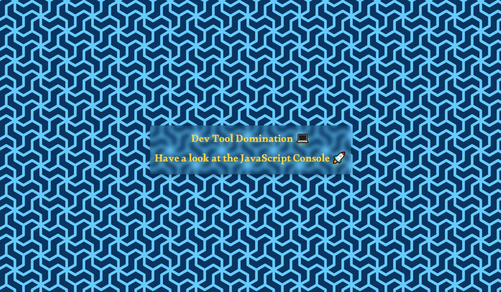

# Dev Tools Domination



In this coding exercise, I explored various **console methods** to enhance my debugging and development experience using the browser's developer tools.
I utilized console methods to output styled **messages**, **warnings**, **errors**, **information**, and more. Additionally, I learned how to group console output, count occurrences, measure time taken, and display data as a table.

## Table of Contents

- [Dev Tools Domination](#dev-tools-domination)
  - [Table of Contents](#table-of-contents)
  - [1. Exploring Console Methods](#1-exploring-console-methods)
    - [Regular Logging](#regular-logging)
    - [Interpolated Logging](#interpolated-logging)
    - [Styled Logging](#styled-logging)
    - [Warning](#warning)
    - [Error](#error)
    - [Info](#info)
  - [2. Testing and Assertions](#2-testing-and-assertions)
    - [Assertion with `console.assert()`](#assertion-with-consoleassert)
  - [3. Console Interaction](#3-console-interaction)
    - [Viewing DOM Elements](#viewing-dom-elements)
  - [4. Grouping and Counting](#4-grouping-and-counting)
    - [Grouping Console Output](#grouping-console-output)
    - [Counting Occurrences](#counting-occurrences)
  - [5. Timing and Performance Measurement](#5-timing-and-performance-measurement)
    - [Timing with `console.time()` and `console.timeEnd()`](#timing-with-consoletime-and-consoletimeend)
  - [6. Data Presentation](#6-data-presentation)
    - [Displaying Data as a Table with `console.table()`](#displaying-data-as-a-table-with-consoletable)

## 1. Exploring Console Methods

### Regular Logging

```js
console.log("Marhaba 👋");
```

### Interpolated Logging

```js
console.log("Hello I am a %s !", "🦄");
```

### Styled Logging

```js
console.log('%c I am some great text', 'font-size:50px; background:red; text-shadow: 10px 10px 0 blue');
```

### Warning

```js
console.warn("Oops ⚠");
```

### Error

```js
console.error("keep away 📛!");
```

### Info

```js
console.info("Why do programmers prefer using the dark mode? Because light attracts bugs!");
```

## 2. Testing and Assertions

### Assertion with `console.assert()`

```js
const p = document.querySelector("p");
console.assert(p.classList.contains("ouch"), "That is wrong!");
```

## 3. Console Interaction

### Viewing DOM Elements

```js
console.log(p);
console.dir(p);
```

## 4. Grouping and Counting

### Grouping Console Output

```js
cats.forEach((dog) => {
  console.groupCollapsed(`${dog.name}`);
  console.log(`This is ${dog.name}`);
  console.log(`${dog.name} is ${dog.age} years old`);
  console.log(`${dog.name} is ${dog.age * 7} dog years old`);
  console.groupEnd(`${dog.name}`);
});
```

### Counting Occurrences

```js
console.count("issam");
console.count("issam");
console.count("seghir");
console.count("seghir");
console.count("issam");
console.count("seghir");
console.count("issam");
console.count("seghir");
console.count("seghir");
console.count("seghir");
console.count("seghir");
console.count("seghir");
```

## 5. Timing and Performance Measurement

### Timing with `console.time()` and `console.timeEnd()`

```js
console.time("fetching data");
const response = await fetch("https://api.github.com/users/wesbos");
const data = await response.json();
console.timeEnd("fetching data");
console.log(data);
```

## 6. Data Presentation

### Displaying Data as a Table with `console.table()`

```js
console.table(cats);
```
