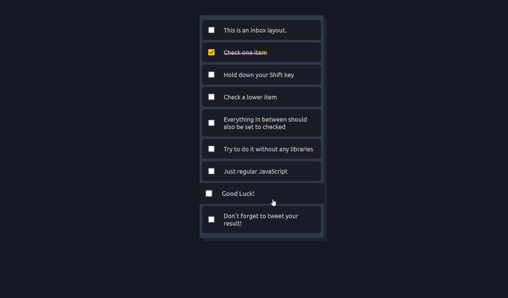

# Hold Shift and Check Checkboxes



In this exercise, I created a checkbox selection feature where users can hold the `Shift` key and click checkboxes to select a range of checkboxes at once.

Let's delve into the code and understand how I **achieved** this and what I **added/fixed** from the original solution.

## Table of Contents

- [Hold Shift and Check Checkboxes](#hold-shift-and-check-checkboxes)
  - [Table of Contents](#table-of-contents)
  - [Features](#features)
  - [How I Made This Happen](#how-i-made-this-happen)
    - [1. Checkbox Selection Logic](#1-checkbox-selection-logic)
  - [What I Added/Fixed](#what-i-addedfixed)
  - [What I Learned](#what-i-learned)

## Features

1. **Shift Key Selection**: Users can hold down the `Shift` key and click checkboxes to select a range of checkboxes between the last clicked checkbox and the currently clicked checkbox.

## How I Made This Happen

### 1. Checkbox Selection Logic

- I selected the `.inbox` element, which contains a list of checkboxes.
- The variable `lastItemSelected` is initialized to **false**. This variable will be used to keep track of the **last** **checkbox** **item** **selected**.
- I added an event listener  to the `.inbox` element for the `click` event.
- This event  will respond when any element within the `.inbox` element is clicked (**delegation** **technique**)
- The `closest` method is used to find the closest **ancestor** (**parent**) element with the class `item`, If found, it queries for an input element with the **attribute** `type="checkbox"` within the `item` element. This represents the checkbox that was clicked.

```js
const inbox = document.querySelector(".inbox");
let lastItemSelected = false;

inbox.addEventListener("click", (e) => {
  const clickedElement = e.target;
  const checkbox = clickedElement.closest(".item")?.querySelector("input[type=checkbox]");

  if (checkbox) {
    if (!clickedElement.matches("input[type=checkbox]")) {
      checkbox.checked = !checkbox.checked;
    }
    const shiftKey = e.shiftKey;
    handleCheckboxClick(checkbox, shiftKey);
  }
});
```

- The `handleCheckboxClick` function is called whenever a checkbox is clicked. It takes the clicked `checkbox` and the `shiftKey` value as parameters.

```js
function handleCheckboxClick(checkbox, shiftKey) {
  if (shiftKey && lastItemSelected && lastItemSelected.checked) {
    // Get all checkboxes
    const checkboxes = [...inbox.querySelectorAll("[type=checkbox]")];
    const lastItemSelectedIndex = checkboxes.indexOf(lastItemSelected);
    const thisIndex = checkboxes.indexOf(checkbox);

    // Select the checkboxes between the last clicked checkbox and the current checkbox
    if (thisIndex > lastItemSelectedIndex) {
      for (let index = lastItemSelectedIndex + 1; index < thisIndex; index++) {
        checkboxes[index].checked = !checkboxes[index].checked;
      }
    } else if (lastItemSelectedIndex > thisIndex) {
      for (let index = lastItemSelectedIndex - 1; index > thisIndex; index--) {
        checkboxes[index].checked = !checkboxes[index].checked;
      }
    }
  }
  lastItemSelected = checkbox;
}
```

## What I Added/Fixed

- I implemented the ability to select a range of checkboxes using the `Shift` key and clicking checkboxes.
- I handled the case where checkboxes are selected in reverse order.

## What I Learned

- **DOM Traversal**: I learned how to use DOM traversal methods like `closest` to find parent elements based on a specific class.
- **Event Handling**: I gained a deeper understanding of handling click events and utilizing the `shiftKey` property to detect when the `Shift` key is held down during the click.
- **Dynamic Interaction**: I explored creating interactive and dynamic UI interactions that simulate real-world behaviors, enhancing user experience.
