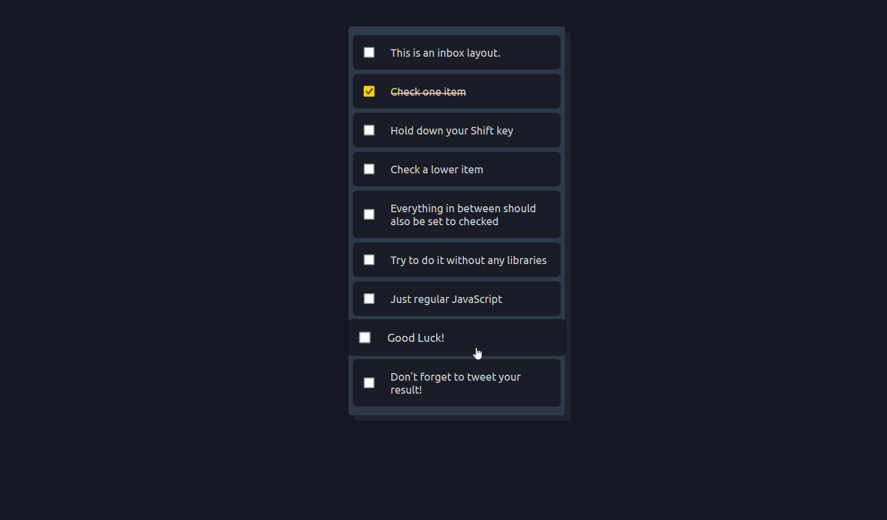

# Hold Shift and Check Checkboxes



In this exercise, I created a checkbox selection feature where users can hold the `Shift` key and click checkboxes to select a range of checkboxes at once.

Let's delve into the code and understand how I **achieved** this and what I **added/fixed** from the original solution.

## Table of Contents

- [Hold Shift and Check Checkboxes](#hold-shift-and-check-checkboxes)
  - [Table of Contents](#table-of-contents)
  - [Features](#features)
  - [How I Made This Happen](#how-i-made-this-happen)
    - [1. Checkbox Selection Logic](#1-checkbox-selection-logic)
      - [Part one](#part-one)
      - [Part Two](#part-two)
        - [Case One: Individual Checkbox Interaction](#case-one-individual-checkbox-interaction)
        - [Case Two: Clicking on  List Item Content (p / item)](#case-two-clicking-on--list-item-content-p--item)
        - [Case Three: Clicking the `.inbox` Container](#case-three-clicking-the-inbox-container)
      - [Part Three](#part-three)
    - [2. Handling Checkbox Clicks with Shift Key Interaction](#2-handling-checkbox-clicks-with-shift-key-interaction)
  - [What I Added/Fixed](#what-i-addedfixed)
  - [What I Learned](#what-i-learned)

## Features

1. **Shift Key Selection**: Users can hold down the `Shift` key and click checkboxes to select a range of checkboxes between the last clicked checkbox and the currently clicked checkbox.

## How I Made This Happen

### 1. Checkbox Selection Logic

#### Part one

- I selected the `.inbox` element, which contains a list of checkboxes.
- The variable `lastItemSelected` is initialized to **false**. This variable will be used to keep track of the **last** **checkbox** **item** **selected**.
- I added an event listener  to the `.inbox` element for the `click` event.
- This event  will respond when any element within the `.inbox` element is clicked (**delegation** **technique**)

```js
    const inbox = document.querySelector(".inbox");
    let lastItemSelected = false;

    inbox.addEventListener("click", (e) => {
      ...
    });
```

#### Part Two

- Users might click on various elements within the list item, such as labels or the list item container itself. In these cases, the event target will be the clicked element, which may not directly represent the associated checkbox.

- To ensure consistent behavior, the code employs a technique to locate the associated checkbox element. It does so by searching for the **closest ancestor** element with the class `.item`, which typically encapsulates the entire list item. From this ancestor, the code then retrieves the corresponding **checkbox element**.

- The `closest` method seeks the nearest **parent** element with the class `.item`. If found, the code proceeds to search for an input element with the **attribute** `type="checkbox"` within that `.item`.

- The **optional chaining operator** (`?.`) is used to gracefully handle cases where the `closest(".item")` does not find any matching ancestor element. When no `.item` ancestor is found, the entire expression evaluates to `null`, ensuring no unexpected errors occur.

```javascript
    const checkbox = clickedElement.closest(".item")?.querySelector("input[type=checkbox]");
```

This construct offers versatility in managing different user interactions:

##### Case One: Individual Checkbox Interaction

- When a checkbox itself is clicked, this line directly selects the checkbox element. This direct selection facilitates toggling the checkbox's checked state.

##### Case Two: Clicking on  List Item Content (p / item)

- This scenario involves clicking on the text content or the checkbox element itself. The line of code ensures that the closest ancestor element with the class `.item` is selected, followed by the checkbox within that `.item`. This is especially useful when users click the paragraph instead of the checkbox to toggle its state.

its look like this :

```javascript
    // item: <div class="item">
    const checkbox = item.querySelector("input[type=checkbox]");
```

##### Case Three: Clicking the `.inbox` Container

- Here, we're exploring the practical utility of the optional chaining operator. Let's start by examining the scenario without using the optional chaining operator to understand the differences.

```javascript
    const checkbox = clickedElement.closest(".item").querySelector("input[type=checkbox]");
```

- In this example, the `clickedElement` represents an element with the class "`inbox."` The `closest(".item")` method is used to find the nearest ancestor element with the class `"item."` However, in this case, **no such parent element exists**.

```html
    <!-- There's no parent with class "item" here -->
    <!-- 👆 -->
    <div class="inbox">
      ...
      <div class="item">
        <input type="checkbox" />
        <p>This is an inbox layout.</p>
      </div>
      ...
    </div>
```

- If the clicked element lacks an ancestor with the class `"item"` the result of `clickedElement.closest(".item")` will be `null`. Subsequently, attempting to call `.querySelector("input[type=checkbox]")` on `null` will result in a `TypeError`.

- The `.querySelector("input[type=checkbox]")` part tries to find an `<input>` element with the attribute `type="checkbox"` within the element found using `.closest(".item")`. If the previous step yields `null`, attempting to call `.querySelector` on `null` will lead to a `TypeError`.

However, in cases where we don't want a `TypeError` (absolutely in this case) and instead want to exclude the `"inbox"` scenario when it's clicked, we need to handle this situation and prevent **errors**. One way is to explicitly check whether `.closest(".item")` returns a non-null value before attempting to call `.querySelector("input[type=checkbox]")`. For instance:

```js
const itemElement = clickedElement.closest(".item");
const checkbox = itemElement ? itemElement.querySelector("input[type=checkbox]") : null;
```

The above code checks if `itemElement` is truthy before proceeding with `.querySelector`. This approach ensures that we don't encounter errors in cases where the ancestor with class `"item"` is not found.

Alternatively, the optional chaining operator (`?.`) can achieve the same result in a more concise manner:

```js
const checkbox = clickedElement.closest(".item")?.querySelector("input[type=checkbox]");
```

By using the optional chaining operator, we streamline the code and achieve the desired behavior without the need for explicit checks and conditional statements. The operator evaluates to `null` if any part of the chain returns `null` or `undefined`.

```js
  inbox.addEventListener("click", (e) => {
     const clickedElement = e.target;

     const checkbox = clickedElement.closest(".item")?.querySelector("input[type=checkbox]");
     if (checkbox) {
      ...
     }
    });
```

#### Part Three

- If the clicked element is not the checkbox itself (as determined by the clickedElement.matches("input[type=checkbox]") condition), the code toggles the checkbox's checked state. This means that clicking on the label or other parts of the list item will toggle the checkbox as well.

```js
...
  if (checkbox) {
    // If the clicked element is not the checkbox itself, toggle its checked state
    if (!clickedElement.matches("input[type=checkbox]")) {
      checkbox.checked = !checkbox.checked;
    }

    // Determine if the shift key is pressed during the click
    const shiftKey = e.shiftKey;

    // Handle the checkbox click and shift key interaction
    handleCheckboxClick(checkbox, shiftKey);
  }
...
```

### 2. Handling Checkbox Clicks with Shift Key Interaction

- `handleCheckboxClick(checkbox, shiftKey)` effectively manages checkbox clicks with the shift key interaction. This function enables users to select multiple checkboxes in a range by holding down the shift key and clicking checkboxes.

- This function takes two parameters: the `checkbox` element that was clicked and a boolean value indicating whether the shift key was pressed (`shiftKey`).

- When the user holds down the shift key and clicks on checkboxes, the code aims to achieve a range selection effect. It identifies the checkboxes between the last clicked checkbox and the current clicked checkbox and toggles their checked state.

- If the shift key is pressed (`shiftKey === true`) and a previous checkbox was clicked (`lastItemSelected` is not `null` and `lastItemSelected.checked === true`), the function proceeds to select a range of checkboxes.

- The function starts by obtaining all checkboxes within the `.inbox` container using the `querySelectorAll` method.

- The indices of the last clicked checkbox and the current clicked checkbox are determined using the `indexOf` method on the array of checkboxes.

- Depending on whether the current clicked checkbox's index is greater or smaller than the last clicked checkbox's index, the code loops through the checkboxes between the two indices. For each checkbox in the range, it toggles the checkbox's checked state using the `!` (not) operator.

- The code concludes by storing the current checkbox (`checkbox`) as the `lastItemSelected`. This way, the function remembers the previous checkbox that was clicked, enabling accurate shift key interactions in subsequent selections.

```javascript
function handleCheckboxClick(checkbox, shiftKey) {
  // Check if shift key is pressed and a checkbox was previously clicked
  if (shiftKey && lastItemSelected && lastItemSelected.checked) {
    // Get all checkboxes within the .inbox container
    const checkboxes = [...inbox.querySelectorAll("[type=checkbox]")];

    // Identify the index of the last clicked checkbox and the current checkbox
    const lastItemSelectedIndex = checkboxes.indexOf(lastItemSelected);
    const thisIndex = checkboxes.indexOf(checkbox);

    // Select checkboxes between the last clicked checkbox and the current checkbox
    if (thisIndex > lastItemSelectedIndex) {
      for (let index = lastItemSelectedIndex + 1; index < thisIndex; index++) {
        checkboxes[index].checked = !checkboxes[index].checked;
      }
    } else if (lastItemSelectedIndex > thisIndex) {
      for (let index = lastItemSelectedIndex - 1; index > thisIndex; index--) {
        checkboxes[index].checked = !checkboxes[index].checked;
      }
    }
  }

  // Store the current checkbox as the last clicked checkbox
  lastItemSelected = checkbox;
}
```

## What I Added/Fixed

- **My own style**
- **Use another algorithme** to handle the problem.
- I handled the case where **checkboxes** are selected in **reverse** **order**.

## What I Learned

- **Event Delegation**: I  employed the event delegation technique to handle checkbox interactions within the `.inbox` container, optimizing performance and reducing unnecessary event listeners.

- **DOM Traversal**: I learned how to use DOM traversal methods like `closest` to find parent elements based on a specific class.
- **Event Handling**: I gained a deeper understanding of handling click events and utilizing the `shiftKey` property to detect when the `Shift` key is held down during the click.
- **Optional Chaining**: I learned the value of the optional chaining operator (?.) for handling complex DOM interactions, ensuring graceful degradation in scenarios where expected elements are not present.
- **Algorithmic Thinking**: I refined my algorithmic thinking by devising an efficient solution for selecting checkboxes within a specified range using the shift key. This implementation involved careful consideration of indices and array iteration.
