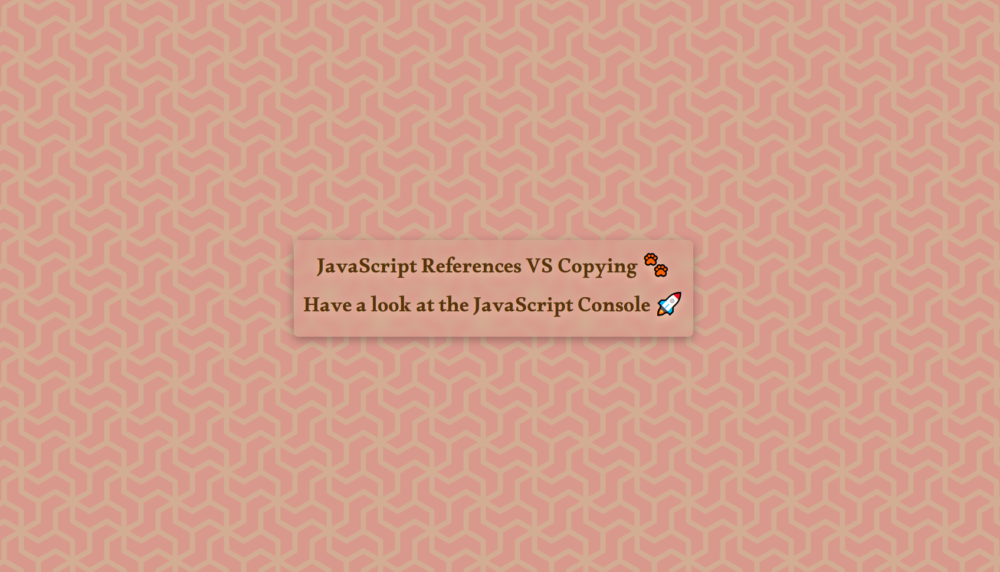

# Copying and Cloning in JavaScript



In this exercise, we explore different methods to create copies and clones of arrays and objects in JavaScript. We will learn how to avoid modifying the original data while working with copies.

Let's delve into the code and understand how I **achieved** this and what I **added/fixed** from the original solution.

## Table of Contents

- [Copying and Cloning in JavaScript](#copying-and-cloning-in-javascript)
  - [Table of Contents](#table-of-contents)
  - [Introduction](#introduction)
  - [Array Copying](#array-copying)
    - [Direct Assignment Issue](#direct-assignment-issue)
    - [Solutions](#solutions)
      - [Using `.slice()` Method](#using-slice-method)
      - [Using `.concat()` Method](#using-concat-method)
      - [Using Spread Operator](#using-spread-operator)
      - [Using `Array.from()` Method](#using-arrayfrom-method)
  - [Object Cloning](#object-cloning)
    - [Using `Object.assign()`](#using-objectassign)
    - [Limitations](#limitations)
  - [Deep Cloning Consideration](#deep-cloning-consideration)

## Introduction

In JavaScript, when working with arrays and objects, it's important to understand how copying and cloning works to avoid unintended side effects on the original data. Let's explore different scenarios for both arrays and objects.

## Array Copying

### Direct Assignment Issue

Let's start with arrays. Directly assigning one array to another doesn't create a new array; it creates a reference to the original array.

```javascript
    const players = ['Issam', 'Aymen', 'Ryan', 'Adam'];
    const team = players; // This is a reference, not a copy
    team[3] = 'Lux'; // This modifies the original 'players' array too
```

### Solutions

#### Using `.slice()` Method

To create a shallow copy of an array, you can use the `.slice()` method.

```javascript
    const team2 = players.slice();
```

#### Using `.concat()` Method

The `.concat()` method can also be used to create a new array by concatenating the elements of the original array.

```javascript
    const team3 = [].concat(players);
```

#### Using Spread Operator

ES6 introduced the spread operator, which provides a concise way to copy an array.

```javascript
    const team4 = [...players];
```

#### Using `Array.from()` Method

The `Array.from()` method can be used to create a new array from an iterable object or array-like structure.

```javascript
    const team5 = Array.from(players);
```

## Object Cloning

### Using `Object.assign()`

When working with objects, you can use `Object.assign()` to create a shallow copy with specific properties modified or added.

```javascript
    const person = {
      name: 'Issam Seghir',
      age: 80
    };

    const cap2 = Object.assign({}, person, { number: 99, age: 12 });
```

### Limitations

Keep in mind that `Object.assign()` creates a shallow copy. If the object contains nested objects, the inner objects will still be referenced.

```js
    const obj = {
      name: 'Issam',
      age: 100,
      social: {
        twitter: '@issam__Dev',
        linkedin: '@issam-seghir'
      }
    };

    console.clear();
    console.log(obj);

    const dev = Object.assign({}, obj);

    const dev2 = JSON.parse(JSON.stringify(obj));

```

## Deep Cloning Consideration

It's important to note that the above methods are only one level deep for both arrays and objects. For more complex structures with nested objects, you might need to explore more sophisticated deep cloning solutions.
