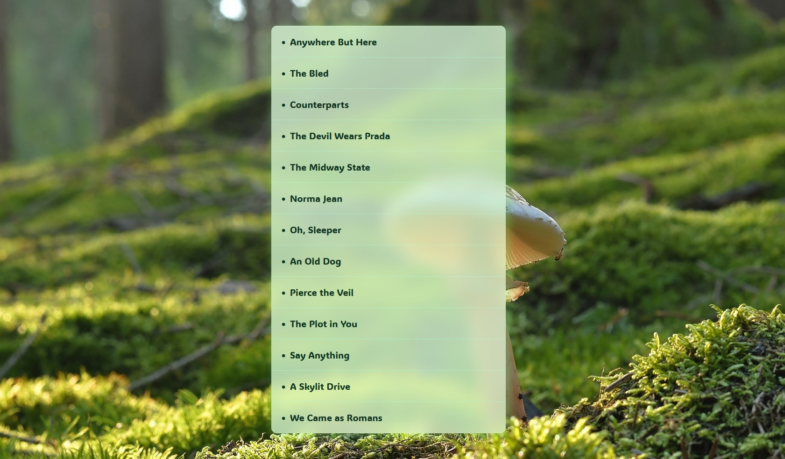

# Quran Reciters Name Sorter



In this project, I've created a simple script that processes a list of reciters' names and generates an ordered list of their names for display. The script utilizes string manipulation techniques to clean and sort the reciter names before rendering them on the webpage.

Let's delve into the code and understand how I **achieved** this and what I **added/fixed** from the original solution.

## Table of Contents

- [Quran Reciters Name Sorter](#quran-reciters-name-sorter)
  - [Table of Contents](#table-of-contents)
  - [How I Made This Happens](#how-i-made-this-happens)
    - [1. Removing Common Prefixes](#1-removing-common-prefixes)
    - [2. Sorting the Reciters](#2-sorting-the-reciters)
    - [3. Displaying the Sorted List](#3-displaying-the-sorted-list)
  - [What I Added/Fixed](#what-i-addedfixed)
  - [What I Learned](#what-i-learned)

## How I Made This Happens

### 1. Removing Common Prefixes

To ensure an accurate and natural sort order, the `strip` function is employed. This function utilizes a regular expression to remove common prefixes such as **"reciter"**, **"imam"**, and **"sheikh"** (regardless of case) from the beginning of each **Reciter** name.

```javascript
    function strip(reciterName) {
     return reciterName.replace(/^(reciter |imam |sheikh )/i, "").trim();
    }
```

### 2. Sorting the Reciters

To enhance the organization of the Reciters' list, the `sortedReciters` array is generated and sorted using a custom sorting function. This function takes into account the stripped versions of the **Reciters**' names, eliminating common prefixes and ensuring consistent sorting.

```javascript
const strippedReciters = reciters.map(strip);
const sortedReciters = strippedReciters.sort((a, b) => (a > b ? 1 : -1));
```

### 3. Displaying the Sorted List

The sorted Reciters' names are dynamically displayed in the HTML document using the following code snippet. The `sortedReciters` array is transformed into a list of `<li>` elements, which are then combined into a single string for seamless insertion into the designated HTML container.

```javascript
document.querySelector("#tilawa").innerHTML = sortedReciters.map((reciter) => `<li>${reciter}</li>`).join("");
```

## What I Added/Fixed

- **My Own Style**

## What I Learned

- **Regular Expressions**: Practical application of regular expressions to manipulate and transform strings.
- **Sorting Algorithms**: Sorting data using custom comparison functions for tailored and improved sorting outcomes.
