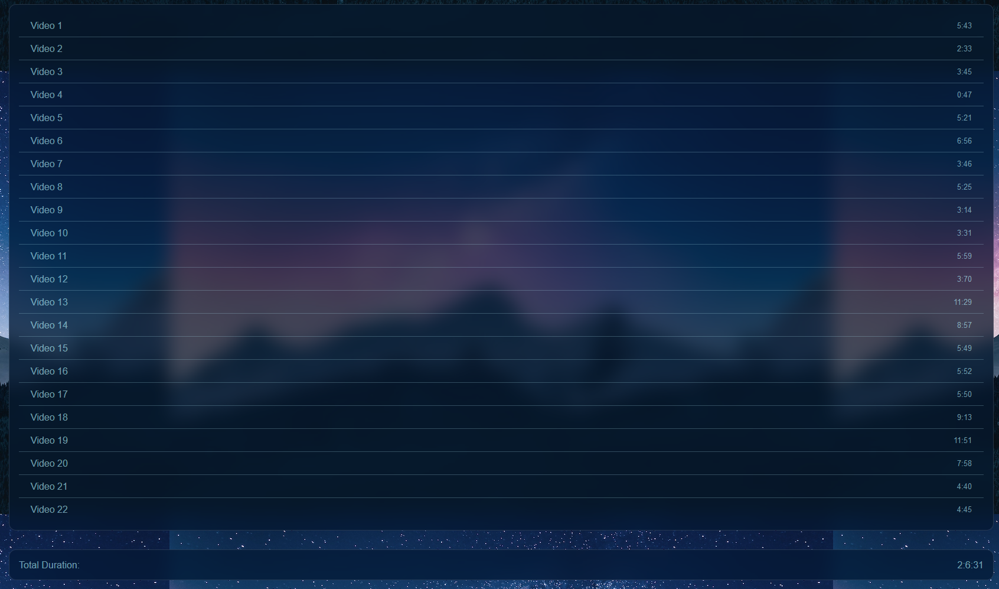

# Total Video Duration Calculator



In this project, I have developed a straightforward program that calculates and presents the total duration of a given list of videos. The project processes the durations of each individual video and calculates the overall time span.

Let's explore how I **achieved** this and what I **added/fixed** to enhance the functionality.

## Table of Contents

- [Total Video Duration Calculator](#total-video-duration-calculator)
  - [Table of Contents](#table-of-contents)
  - [How I Made This Happen](#how-i-made-this-happen)
    - [1. Iterating Through Video Items](#1-iterating-through-video-items)
    - [2. Parsing Video Durations](#2-parsing-video-durations)
    - [3. Updating HTML Content](#3-updating-html-content)
    - [4. Calculating Total Duration](#4-calculating-total-duration)
  - [What I Added/Fixed](#what-i-addedfixed)
  - [What I Learned](#what-i-learned)

## How I Made This Happen

### 1. Iterating Through Video Items

I used the `document.querySelectorAll()` method to select all the video items in the HTML. These items are typically represented as list items (`<li>`) within an ordered or unordered list.

```js
    const videoItems = document.querySelectorAll(".videos li");
```

### 2. Parsing Video Durations

For each video item, I extracted the duration from the `data-time` attribute using the `.dataset.time` property. This attribute stores the duration in the format `mm:ss`. I then parsed the minutes and seconds using the `split(":")` method and calculated the duration in seconds.

```js

    videoItems.forEach((item) => {
        // Get the duration from the dataset
        const duration = item.dataset.time;
        const [minutes, seconds] = duration.split(":");
        const itemSeconds = Number.parseInt(minutes) * 60 + Number.parseInt(seconds);

        // Add the current video's duration to the total
        totalSeconds += itemSeconds;

        // Calculate hours, minutes, and seconds for the current video
        ...
```

### 3. Updating HTML Content

To display the video's duration, I computed the hours, minutes, and seconds from the total seconds. I used string template literals to update the HTML content of each video item with the formatted duration.

```js

    videoItems.forEach((item) => {
        // Get the duration from the dataset
        const duration = item.dataset.time;
        const [minutes, seconds] = duration.split(":");
        const itemSeconds = Number.parseInt(minutes) * 60 + Number.parseInt(seconds);

        // Add the current video's duration to the total
        totalSeconds += itemSeconds;

        // Calculate hours, minutes, and seconds for the current video
        const hours = Math.floor(itemSeconds / 3600);
        const remainingSeconds = itemSeconds % 3600;
        const mins = Math.floor(remainingSeconds / 60);
        const finalSeconds = remainingSeconds % 60;
        // Update the HTML content of the current video item
        item.innerHTML = `
              <span>${item.textContent.trim()}</span>
              <span class="duration">${hours === 0 ? "" : `${hours}:`}${mins}:${finalSeconds.toString().padEnd(2, "0")}</span>
              `;
       });
```

### 4. Calculating Total Duration

To calculate the total duration, I accumulated the individual video durations in seconds. I then converted the total seconds into hours, minutes, and remaining seconds. Finally, I updated the HTML content of an element with the class `.total` to display the total duration.

```js
    videoItems.forEach((item) => {
        // Get the duration from the dataset
        ...
        // Add the current video's duration to the total
        totalSeconds += itemSeconds;
        ...
    });

    // Calculate total hours, minutes, and seconds
    const totalHours = Math.floor(totalSeconds / 3600);
    const remainingTotalSeconds = totalSeconds % 3600;
    const totalMinutes = Math.floor(remainingTotalSeconds / 60);
    const totalFinalSeconds = remainingTotalSeconds % 60;

    // Display the total duration on the page
    const totalDurationElement = document.querySelector(".total");
    totalDurationElement.innerHTML = `
        <span> Total Duration:</span>
        <span class="duration"> ${totalHours}:${totalMinutes}:${totalFinalSeconds}</span>
      `;
```

## What I Added/Fixed

- **My Own Style**
- **Improved Presentation**: I enhanced the user experience by presenting the duration of each video in a more human-readable format (`hh:mm:ss`) with the total duration displayed .

## What I Learned

- **Parsing Data Attributes**: How to retrieve and parse data stored in HTML data attributes.
- **String Manipulation**: Using string manipulation techniques to format and present data in a readable way.
