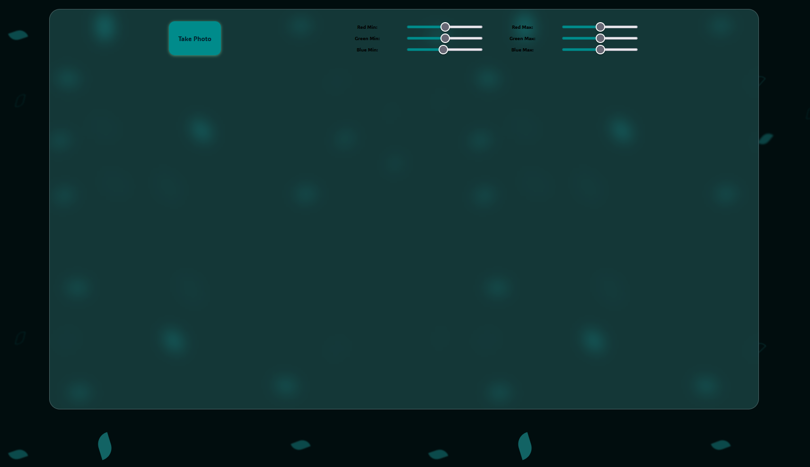

# Webcam Fun: Live Video Effects



In this project, I created a simple webcame that captures live video from the user's webcam and applies various visual effects to the video feed. The project leverages the user's webcam and the HTML5 Canvas element to provide a real-time video manipulation experience.

Let's explore how I **achieved** this and what I **added/fixed** to enhance the functionality.

> NOTE: based on **MDN** and in the time that i write this **08/2023**  **getUserMedia() API** its a **Secure context** see: [MDN : getUserMedia API](https://developer.mozilla.org/en-US/docs/Web/API/MediaDevices/getUserMedia).
> **Secure context** : This feature is available only in secure contexts (HTTPS), in some or all supporting browsers.
The `getVideo` function utilizes the `navigator.mediaDevices.getUserMedia` API to access the user's webcam. It starts the video playback and displays the webcam feed on the web page.

> to setup https for testing locally this project , read this [section](../readme.md) in the readme  , see also : [How to use HTTPS for local development (web.dev)](https://web.dev/how-to-use-local-https/)

## Table of Contents

- [Webcam Fun: Live Video Effects](#webcam-fun-live-video-effects)
  - [Table of Contents](#table-of-contents)
  - [Features](#features)
  - [How I Made This Happen](#how-i-made-this-happen)
    - [1. Accessing the Webcam](#1-accessing-the-webcam)
    - [2. Drawing Video to the Canvas](#2-drawing-video-to-the-canvas)
    - [3. Applying Visual Effects](#3-applying-visual-effects)
    - [4. Capture Photos](#4-capture-photos)
  - [What I Added/Fixed](#what-i-addedfixed)
  - [What I Learned](#what-i-learned)

## Features

- **Real-Time Video Capture**: Accesses the user's webcam and captures live video feed.
- **Visual Effects**: Applies various visual effects in real time, such as red channel boost, RGB color splitting, and green screen effects.
- **Photo Capture**: Allows users to capture snapshots of the video feed and save them as downloadable images.

## How I Made This Happen

### 1. Accessing the Webcam

```js
    const video = document.querySelector(".player");

    // Access the user's camera and display video stream on the page
    function getVideo() {
     navigator.mediaDevices
      .getUserMedia({ video: true, audio: false })
      .then((localMediaStream) => {
       console.log(localMediaStream);
       video.srcObject = localMediaStream;
       video.play();
      })
      .catch((err) => {
       console.error(`OH NO!!!`, err);
      });
    }
    ...
    // Start capturing video from the user's camera
    getVideo();

```

### 2. Drawing Video to the Canvas

The `paintToCanvas` function is called when the `video` element's `canplay` event is triggered. This function draws the current video frame onto an HTML5 Canvas element. The video feed is continually drawn to the canvas using the `ctx.drawImage` method.

> we talk about the usefull functions i create `rgbSplit()` / `redEffect()` / `greenScreen()`  later sonner

```js
    const canvas = document.querySelector(".photo");
    const ctx = canvas.getContext("2d");
    ...

    function paintToCanvas() {
     const width = video.videoWidth;
     const height = video.videoHeight;
     canvas.width = width;
     canvas.height = height;

     return setInterval(() => {
      ctx.drawImage(video, 0, 0, width, height);
      // take the pixels out
      let pixels = ctx.getImageData(0, 0, width, height);
      // mess with them
      // pixels = redEffect(pixels);

      pixels = rgbSplit(pixels);
      // ctx.globalAlpha = 0.8;

      // pixels = greenScreen(pixels);
      // put them back
      ctx.putImageData(pixels, 0, 0);
     }, 16);
    }
    ...

    video.addEventListener("canplay", paintToCanvas);
```

### 3. Applying Visual Effects

Various visual effects are implemented as separate functions, including `redEffect`, `rgbSplit`, and `greenScreen`. These functions manipulate the pixel data of the canvas to create different visual effects.

- `redEffect`: Enhances the red channel of the pixel colors, creating a red-tinted effect.
- `rgbSplit`: Shifts the RGB channels of the pixel colors, creating a color-splitting effect.
- `greenScreen`: Implements a green screen effect by removing pixels that fall within specified RGB range values.

```js

    // Apply a red color effect to pixels
    function redEffect(pixels) {
     for (let i = 0; i < pixels.data.length; i += 4) {
      pixels.data[i + 0] = pixels.data[i + 0] + 200; // RED
      pixels.data[i + 1] = pixels.data[i + 1] - 50; // GREEN
      pixels.data[i + 2] = pixels.data[i + 2] * 0.5; // Blue
     }
     return pixels;
    }

    // Apply an RGB split effect to pixels
    function rgbSplit(pixels) {
     for (let i = 0; i < pixels.data.length; i += 4) {
      pixels.data[i - 150] = pixels.data[i + 0]; // RED
      pixels.data[i + 500] = pixels.data[i + 1]; // GREEN
      pixels.data[i - 550] = pixels.data[i + 2]; // Blue
     }
     return pixels;
    }


    // Apply a green screen effect to pixels
    function greenScreen(pixels) {
     const levels = {};

     // Extract RGB level values from input elements
     document.querySelectorAll(".rgb input").forEach((input) => {
      levels[input.name] = input.value;
     });

     for (i = 0; i < pixels.data.length; i = i + 4) {
      red = pixels.data[i + 0];
      green = pixels.data[i + 1];
      blue = pixels.data[i + 2];
      alpha = pixels.data[i + 3];

      // Check if pixel values fall within the specified range
      if (red >= levels.rmin && green >= levels.gmin && blue >= levels.bmin && red <= levels.rmax && green <= levels.gmax && blue <= levels.bmax) {
       // Make pixel transparent
       pixels.data[i + 3] = 0;
      }
     }

     return pixels;
    }

```

### 4. Capture Photos

```js
    // Capture a photo from the current canvas and display it
    function takePhoto() {
     // play the sound
     snap.currentTime = 0;
     snap.play();

     // take the data out of the canvas
     const data = canvas.toDataURL("image/jpeg");
     const link = document.createElement("a");
     link.href = data;
     link.setAttribute("download", "handsome");
     link.innerHTML = ``;
     strip.insertBefore(link, strip.firstChild);
}
```

## What I Added/Fixed

- **My Own Style**.

## What I Learned

- **Webcam Integration**: Learned how to access and utilize the user's webcam using the `getUserMedia` API.
- **Setup Https Server** for testing **Secure context API**
- **Real-Time Effects**: Implemented real-time visual effects by modifying pixel data on the canvas.

