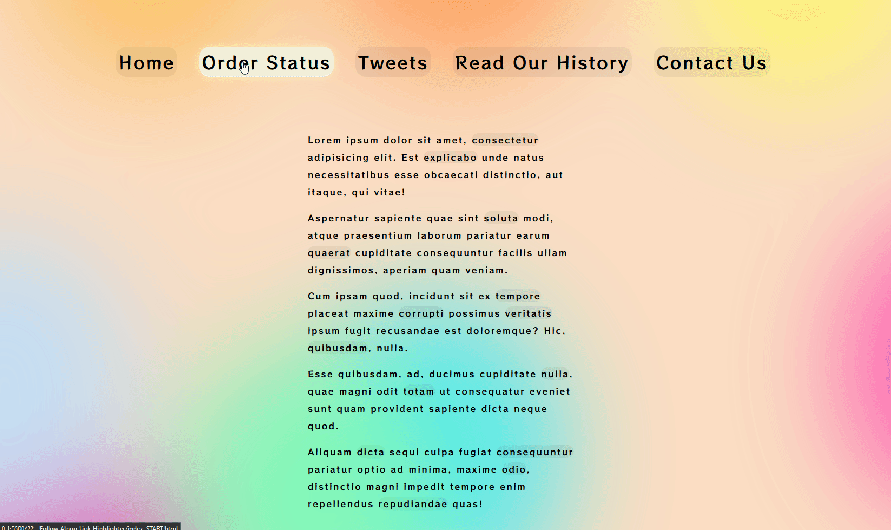

# Interactive Link Highlighter



This project demonstrates how to create an interactive link highlighter using JavaScript. As users hover over links on a web page, a dynamic highlight effect is applied to each link, providing a visually engaging interaction.

Let's explore how I **achieved** this and what I **added/fixed** to enhance the functionality.

## Table of Contents

- [Interactive Link Highlighter](#interactive-link-highlighter)
  - [Table of Contents](#table-of-contents)
  - [Features](#features)
  - [How I Made This Happen](#how-i-made-this-happen)
    - [Highlight Effect Creation](#highlight-effect-creation)
  - [What I Added/Fixed](#what-i-addedfixed)
  - [What I Learned](#what-i-learned)

## Features

- **Interactive Highlight Effect**: Enhances user experience by dynamically highlighting links when hovered over.

## How I Made This Happen

### Highlight Effect Creation

The code leverages the `mouseenter` event to apply the highlight effect to links as users hover over them. Here's how it works:

```js
    triggers.forEach((a) => a.addEventListener("mouseenter", highlightLink));
```

- **Link Selection**: The code selects all `<a>` elements on the page using `document.querySelectorAll("a")`.

- **Highlight Element Creation**: A `<span>` element with the class `.highlight` is created. This element represents the highlight effect and is appended to the `<body>`.

```js
    // select all links on the page
    const triggers = document.querySelectorAll("a");

    // create a span represent the highlight effect
    const highlight = document.createElement("span");
    highlight.classList.add("highlight");
    document.body.append(highlight);
```

- **Highlight Effect Calculation**: The `highlightLink()` function is triggered when a link is hovered over (`mouseenter` event). This function calculates the dimensions and position of the hovered link using the `getBoundingClientRect()` method. The dimensions and position are extracted from the resulting bounding rectangle.
- **Highlight Style**: The calculated dimensions and position are used to update the style of the `.highlight` element. This updates the width, height, and position of the highlight effect to match the hovered link.

```js
    function highlightLink() {
         // Get the bounding rectangle of the hovered link
        const linkCoords = this.getBoundingClientRect();
        console.log(linkCoords);

        // Extract dimensions and position from the bounding rectangle
        const coords = {
         width: linkCoords.width,
         height: linkCoords.height,
         top: linkCoords.top + window.scrollY,
         left: linkCoords.left + window.scrollX,
        };

        // Apply highlight styles to the created span element
        highlight.style.width = `${coords.width}px`;
        highlight.style.height = `${coords.height}px`;
        highlight.style.transform = `translate(${coords.left}px, ${coords.top}px)`;
       }
```

## What I Added/Fixed

- **My own style**

## What I Learned

- **Bounding Rectangle**: Explored the `getBoundingClientRect()` method to determine the dimensions and position of elements on the page.
- **Dynamic Styling**: Demonstrated how to dynamically update element styles to achieve visual effects.
