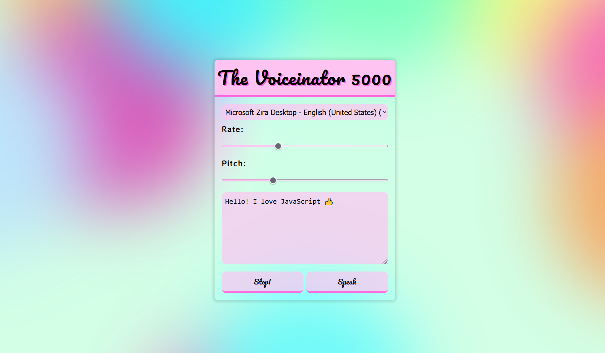

# Interactive Speech Synthesis



This project showcases how to create an interactive speech synthesis interface using the Web Speech API. Users can input text, select a voice, adjust speech rate and pitch, and control speech playback.
Let's explore how I **achieved** this and what I **added/fixed** to enhance the functionality.

## Table of Contents

- [Interactive Speech Synthesis](#interactive-speech-synthesis)
  - [Table of Contents](#table-of-contents)
  - [Features](#features)
  - [How It Works](#how-it-works)
    - [1. Speech Synthesis initialisation](#1-speech-synthesis-initialisation)
    - [2. Updating Speech Synthesis Options](#2-updating-speech-synthesis-options)
    - [3. Starting Speech Synthesis](#3-starting-speech-synthesis)
  - [What I Added/Fixed](#what-i-addedfixed)
  - [What I Learned](#what-i-learned)

## Features

- **Interactive Interface**: Allows users to customize and control speech synthesis parameters.
- **Voice Selection**: Offers a dropdown menu for users to choose from available voices.
- **Speech Rate and Pitch**: Enables users to adjust the speed and pitch of the synthesized speech.
- **Playback Control**: Users can start and stop speech synthesis at any time.

## How It Works

### 1. Speech Synthesis initialisation

- A `SpeechSynthesisUtterance` instance named `message` is created to manage speech synthesis. This instance will hold the text to be synthesized and various synthesis options.

- The `options` array contains input elements and range sliders that allow users to adjust speech synthesis options such as speech rate and pitch. Event listeners are added to these elements to update the corresponding properties of the `msg` object.

```js
    // Create a SpeechSynthesisUtterance instance to manage speech synthesis
       const message = new SpeechSynthesisUtterance();
       console.log(message);

       // Array to store available voices
       let voices = [];

       // Select elements from the DOM
       const voicesDropdown = document.querySelector('[name="voice"]');
       const options = document.querySelectorAll('[type="range"], [name="text"]');
       const speakButton = document.querySelector("#speak");
       const stopButton = document.querySelector("#stop");

       // Set the initial text content for speech synthesis
       message.text = document.querySelector('[name="text"]').value;
```

### 2. Updating Speech Synthesis Options

- The `updateOptions()` function is responsible for capturing changes to options and updating the corresponding property of the message object. This object (message) is presumably defined elsewhere in the code.

```js
    // Function to update the speech synthesis options based on user input
    function updateOptions(e) {
      console.log(this.name);
      // Update the corresponding property of the 'msg' object with the new value
      message[this.name] = this.value;
      console.log(message);
   }

    // Listen for changes in options and input elements
    options.forEach((option) => {
     option.addEventListener("change", updateOptions);
     option.addEventListener("input", updateOptions);
    });
```

### 3. Starting Speech Synthesis

- The `startSpeech()` function is triggered when the "**Speak**" button is clicked. It uses `speechSynthesis.speak(msg)` to initiate speech synthesis with the provided text and options.

- The `populateVoices()` function populates the voices dropdown with available voices when the page loads and listens for the `voiceschanged` event to update the list of voices.

```js
    // Function to start speech synthesis
     function startSpeech() {
      speechSynthesis.speak(message);
     }

     // Function to populate available voices in the dropdown menu
     function populateVoices() {
      voices = speechSynthesis.getVoices();
      voicesDropdown.innerHTML = voices
       .filter((voice) => voice.lang.includes("en"))
       .map((voice) => `<option value="${voice.name}">${voice.name} (${voice.lang})</option>`)
       .join("");

      // Select a default voice if available
      if (voicesDropdown.options.length > 0) {
       voicesDropdown.value = voicesDropdown.options[0].value;
       message.voice = voices.find((voice) => voice.name === voicesDropdown.value);
      }
     }

    // Populate voices when the page loads
    populateVoices();

    speechSynthesis.addEventListener("voiceschanged", populateVoices);
    speakButton.addEventListener("click", startSpeech);

```

## What I Added/Fixed

- **My own style**

## What I Learned

- **Web Speech API**: Explored the capabilities of the Web Speech API to enable speech synthesis.
- **Event Handling**: Utilized event listeners like `voiceschanged`.
