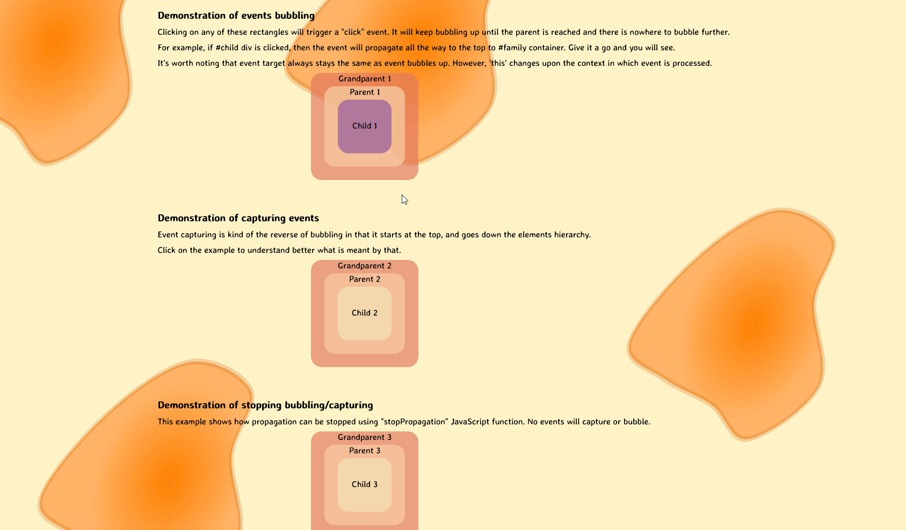

# Event Handling Bubbling & Capturing concept



This code demonstrates the concepts of event **bubbling**, **capturing**, and the `stopPropagation()` method in JavaScript. Event **bubbling** and **capturing** are two phases of event **propagation** that occur when an event is triggered on an element. This example uses the **SweetAlert2** library to create informative alerts for visualization purposes.

Let's explore how I **achieved** this and what I **added/fixed** to enhance the functionality.

## Table of Contents

- [Event Handling Bubbling \& Capturing concept](#event-handling-bubbling--capturing-concept)
  - [Table of Contents](#table-of-contents)
  - [Features](#features)
  - [Introduction](#introduction)
  - [How It Works](#how-it-works)
    - [1. Event Bubbling Example](#1-event-bubbling-example)
    - [2. Event Capturing Example](#2-event-capturing-example)
    - [3. stopPropagation Example](#3-stoppropagation-example)
  - [What I Added/Fixed](#what-i-addedfixed)
  - [What I Learned](#what-i-learned)

## Features

- **Event Bubbling Visualization**: See how events bubble up through the DOM hierarchy when you interact with different elements.
- **Event Capturing Illustration**: Experience the capturing phase as events propagate from the root to the target element.
- **stopPropagation Demonstration**: Learn how to halt event propagation using the stopPropagation() method.
- **Interactive Learning**: Understand event propagation concepts through interactive visualizations and informative alerts.

## Introduction

- In the context of web development, event **propagation** refers to how events are handled as they move through the DOM hierarchy. Events can propagate in two phases: **bubbling** (from the target element up to the root) and **capturing** (from the root down to the target).
- This code examples explores these phases and demonstrates how to stop an event from further propagation using the `stopPropagation()` method.

## How It Works

### 1. Event Bubbling Example

- The code starts by selecting the elements in the HTML with IDs `family1` and its child containers. It then adds click event listeners to each container in `family1`.
- The `showAlerts(targetId, element)` function is called on click, which iterates through the DOM tree and displays a **Swal** **alert** at each step. It showcases the process of event bubbling.

> "`showAlerts()`" is solely designed to visually demonstrate the concept, employing sweet alert popups. In practical scenarios, the bubbling occurs in the same manner as when you click and observe the visualization."

```js
 // Select family1 and its containers
   let family1 = document.querySelector("#family1");
   let family1Containers = family1.querySelectorAll("div");

   // Add click event listeners to each container in family1
   family1Containers.forEach((container) => {
    container.addEventListener("click", async (event) => {
     let targetId = event.target.id;
     await showAlerts(targetId, event.target); // Call showAlerts function on click
    });
   });

    // Function to display Swal alerts with visual bubbling concept
    async function showAlerts(targetId, element) {...}

   // ---------- in real world your will test this --------
    function logText(e) {
        console.log("%cBubbling", "color: red; font-size: 20px;");
        console.log("target (clicked) =", e.target);
        console.log("this (bubble up) =", e.currentTarget);
        console.log("---------------------");
        // e.stopPropagation(); // stop bubbling!
       }

       family1Containers.forEach((container) => container.addEventListener("click", logText));

```

### 2. Event Capturing Example

- The code selects elements with IDs `family2` and `grandparent2`. It adds a click event listener to `family2` with **capturing** enabled (**true**).
- When `family2` is clicked, the **capturing** phase is demonstrated by traversing the DOM tree from the root to the target element (`grandparent2`). **Swal** alerts are displayed at each step to visualize the **capturing** phase.

> "`showAlerts()`" is solely designed to visually demonstrate the concept, employing sweet alert popups. In practical scenarios, the capturing occurs in the same manner as when you click and observe the visualization."

```js
    // Select family2 and grandparent2
    let family2 = document.querySelector("#family2");
    let grandparent2 = document.querySelector("#grandparent2");

     // Add click event listener to family2 with capturing
     family2.addEventListener("click",
        async (event) => {
        let targetId = event.target.id;
        let current = event.target;
        ...
        // Display Swal alert
        await Swal.fire({...})},
      true // Use capturing for the click event
     );


    // ---------- in real world your will test this --------
   function logTextTwo(e) {
    console.log("%cCapturing", "color: blue; font-size: 20px;");
    console.log("target (clicked) =", e.target);
    console.log("this (Capture down) =", e.currentTarget);
    console.log("---------------------");
    // e.stopPropagation(); // stop Capturing!
   }

   let family2Containers = family2.querySelectorAll("div");
   family2Containers.forEach((container) => {
    container.addEventListener("click", logTextTwo, { capture: true });
   });

```

### 3. stopPropagation Example

- The code selects elements with IDs `family3` and its child elements. It adds a click event listener to `family3`.
- When an element within `family3` is clicked, the `stopPropagation()` method is used to **prevent** the event from **propagating** further. A **Swal** **alert** is displayed to illustrate the process.

```js
    // Select family3, grandparent3, and parent3
    let family3 = document.querySelector("#family3");

    // Add click event listener to family3
    family3.addEventListener("click", async (event) => {
     let targetId = event.target.id;
      ...
     // Display Swal alert
     await Swal.fire({...});
     e.stopPropagation(); // stop Capturing & bubbling
    });

    // ---------- in real world your will test this --------
    function logTextThree(e) {
        console.log("%cstopPropagation", "color: green; font-size: 20px;");
        console.log("target (clicked) =", e.target);
        console.log("this =", e.currentTarget);
        console.log("---------------------");
        e.stopPropagation(); // stop Capturing & Bubbling!
    }
    let family3Containers = family3.querySelectorAll("div");
    family3Containers.forEach((container) => {
        container.addEventListener("click", logTextThree);
    });
```

## What I Added/Fixed

- **My own style**
- Using **sweetAlert2** library for more visualization

## What I Learned

- **Event Propagation**: Gained insight into the **capturing** and **bubbling** phases of event propagation.
- **Stop Event Propagation** :  using the `stopPropagation()`method to control event propagation and prevent unwanted effects.
- **Single-Use Listeners**: Used the `once` modifier to automatically remove event listeners after they are triggered once.
