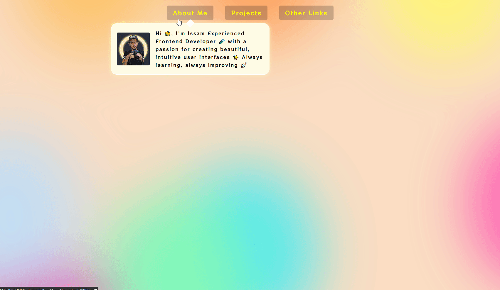

# Dropdown (Strip) Navigation Animation



This code example illustrates the creation of a dropdown navigation menu with animation effects triggered by mouse events. It showcases the use of classes and transitions to achieve smooth dropdown interactions.

Let's explore how I **achieved** this and what I **added/fixed** to enhance the functionality.

## Table of Contents

- [Dropdown (Strip) Navigation Animation](#dropdown-strip-navigation-animation)
  - [Table of Contents](#table-of-contents)
  - [Features](#features)
  - [How It Works](#how-it-works)
    - [1. Event Listeners Setup](#1-event-listeners-setup)
    - [2. Handling Mouse Enter](#2-handling-mouse-enter)
    - [3. Handling Mouse Leave](#3-handling-mouse-leave)
  - [What I Added/Fixed](#what-i-addedfixed)
  - [What I Learned](#what-i-learned)

## Features

- **Smooth Animation**: Demonstrates smooth dropdown animations with CSS transitions for an enhanced user experience.

## How It Works

### 1. Event Listeners Setup

- The code begins by selecting all menu items with the class `cool > li` and the background element using `querySelector`.
- The `handleEnter` and `handleLeave` functions are defined to handle mouse enter and leave events, respectively.
- Event listeners are attached to each menu item using the `forEach` method and the `addEventListener` function. The listeners respond to `mouseenter` and `mouseleave` events by invoking the appropriate handler functions.

```js
    const triggers = document.querySelectorAll(".cool > li");
    const background = document.querySelector(".dropdownBackground");
    const nav = document.querySelector(".top");

    function handleEnter() {...}
    function handleLeave() {...}

    triggers.forEach((trigger) => trigger.addEventListener("mouseenter", handleEnter));
    triggers.forEach((trigger) => trigger.addEventListener("mouseleave", handleLeave));
```

### 2. Handling Mouse Enter

- The `handleEnter` function is triggered when the mouse enters a menu item. It adds the classes `trigger-enter` and `trigger-enter-active` to the menu item.
- A timeout of **150ms** is set using `setTimeout` to ensure that the `trigger-enter-active` class is only added after the specified delay and if the `trigger-enter` class is still present.
- The background element's class is also updated to `open`.

```js
function handleEnter() {
    this.classList.add("trigger-enter");
    // Add "trigger-enter-active" class after a delay, if "trigger-enter" class still present
    setTimeout(() => this.classList.contains("trigger-enter") && this.classList.add("trigger-enter-active"), 150);
    background.classList.add("open");

    const dropdown = this.querySelector(".dropdown");
    const dropdownCoords = dropdown.getBoundingClientRect();
    const navCoords = nav.getBoundingClientRect();

    // Calculate the adjusted coordinates relative to the navigation element
    const coords = {
     height: dropdownCoords.height,
     width: dropdownCoords.width,
     top: dropdownCoords.top - navCoords.top,
     left: dropdownCoords.left - navCoords.left,
    };
    // Set the background element's width, height, and position based on dropdown coordinates
    background.style.setProperty("width", `${coords.width}px`);
    background.style.setProperty("height", `${coords.height}px`);
    background.style.setProperty("transform", `translate(${coords.left}px, ${coords.top}px)`);
   }


```

### 3. Handling Mouse Leave

- The `handleLeave` function is triggered when the mouse leaves a menu item. It removes the classes `trigger-enter` and `trigger-enter-active` from the menu item.
- The background element's class is also updated to remove the `open` class.

```js
   function handleLeave() {
    this.classList.remove("trigger-enter", "trigger-enter-active");
    background.classList.remove("open");
   }

```

## What I Added/Fixed

- **My own style**

## What I Learned

- **Dropdown Animation**: Explored how to create animated dropdown menus using CSS classes and transitions.
