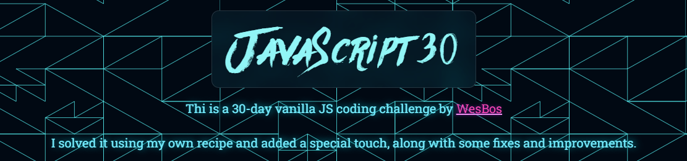

<div align="center">

<h1 align="center" > JavaScript 30</h1>


[](https://choosealicense.com/licenses/mit/)


  <p align="center">
This project is my own recap of  <a href="https://javascript30.com/"> Wes Boss JavaScript 30</a> course. It encompasses all the challenges and exercises from the original course, enhanced with additional features and improvements.

If you appreciate it, please consider giving it a star ⭐
 <br />
    <a href="https://issam-seghir.github.io/JavaScript30/"><strong>Read the Notes »</strong></a>
    <br />
    <br />
    <a href="https://issam-seghir.github.io/JavaScript30/">View Demo</a>
    .
    <a href="https://github.com/issam-seghir/JavaScript30/issues">Report Bug</a>
    .
    <a href="https://github.com/issam-seghir/JavaScript30/pulls">Request Feature</a>
  </p>

<br>
</div>

<!-- TABLE OF CONTENTS -->
<details>
  <summary>Table of Contents</summary>
  <ol>
    <li>
      <a href="#key-features">Key Features</a>
    </li>
    <li>
      <a href="#getting-started">Getting Started</a>
      <ul>
        <li>
          <a href="#installation">Installation</a>
            <ul>
              <li>
                <a href="#setup-https">Setup HTTPS</a>
                  <ul>
                    <li>
                      <a href="#step-1-globally">Step 1: Globally</a>
                    </li>
                    <li>
                      <a href="#step-2-inside-the-project-folder">Step 2: Inside the project folder</a>
                    </li>
                    <li>
                      <a href="#step-3-configure-your-server">Step 3: Configure Your Server</a>
                    </li>
                    <li>
                      <a href="#step-4-accept-the-warning">Step 4: Accept the Warning</a>
                    </li>
                  </ul>
              </li>
            </ul>
        </li>
      </ul>
    </li>
    <li><a href="#contributing">Contributing</a></li>
    <li><a href="#license">License</a></li>
  </ol>
</details>
<hr>

<!--  -->


## Key Features

- Unique styles and solutions 🎨
- Enhancements for improved performance 🚀
- Resolved issues with both style and JavaScript code ✅
- Utilized modern techniques like intersection observation 🌐
- Comprehensive blog notes for each exercise 📝
- Infused with my distinct style and touch ✨

## Getting Started

### Installation

- Clone the repo

   ```sh
   git clone git@github.com:issam-seghir/JavaScript30.git
   ```

> Note : As of **August 2023**, **getUserMedia() API** is considered to be in a **Secure context**, according to [MDN: getUserMedia API](https://developer.mozilla.org/en-US/docs/Web/API/MediaDevices/getUserMedia). A **"Secure context"** implies that this feature is only available in secure contexts (**HTTPS**) in some or all supporting browsers.

- Cloning the repo is sufficient for most exercises, except for `19 - webcam` & `21 - geolocation`.
- If you want to test these two exercises locally, you need to set up HTTPS for `19 - webcam` and localhost for `21 - geolocation`.
- Setting up **HTTPS** is sufficient for both. If you are genuinely interested in testing these two exercises locally, please read the following instructions.

#### Setup HTTPS

##### Step 1: Globally

- Install mkcert to generate a local certificate authority (CA) using your preferred package manager. In this example, I use Scoop, a package manager for Windows.
- The CA certification is stored in the user folder.

```bash
# Generate a local certificate authority (CA).
# (This is only trusted locally on your device.)
scoop install mkcert
mkcert -install
```

##### Step 2: Inside the project folder

```bash
# Generate a certificate for your site
# with the hostname (localhost)
cd <project-folder>
mkcert localhost
```

This will generate two files:

- `localhost.crt`
- `localhost.key`

> Note: It's important to ensure that these two files remain secret, and no one can access them. Be sure to add them to .gitignore before exposing them with a commit.

##### Step 3: Configure Your Server

```bash
# This will install http-server for you
npm install
# This will generate an HTTPS link for you
npm start
```

##### Step 4: Accept the Warning

This warning appears because the certification is self-created locally. The browser is trying to protect you, but it is safe to ignore this warning.


<br>
<hr>

## Contributing

Contributions are what make the open source community such an amazing place to learn, inspire, and create. Any contributions you make are **greatly appreciated**.

If you have a suggestion that would make this better, please fork the repo and create a pull request. You can also simply open an issue with the tag "enhancement".
Don't forget to give the project a star! Thanks again!

1. Fork the Project
2. Create your Feature Branch (`git checkout -b feature/AmazingFeature`)
3. Commit your Changes (`git commit -m 'Add some AmazingFeature'`)
4. Push to the Branch (`git push origin feature/AmazingFeature`)
5. Open a Pull Request

<!-- LICENSE -->
## License

Distributed under the MIT License. See `LICENSE.txt` for more information.

<a href="https://www.buymeacoffee.com/issam.seghir" target="_blank"></a>
</div>
